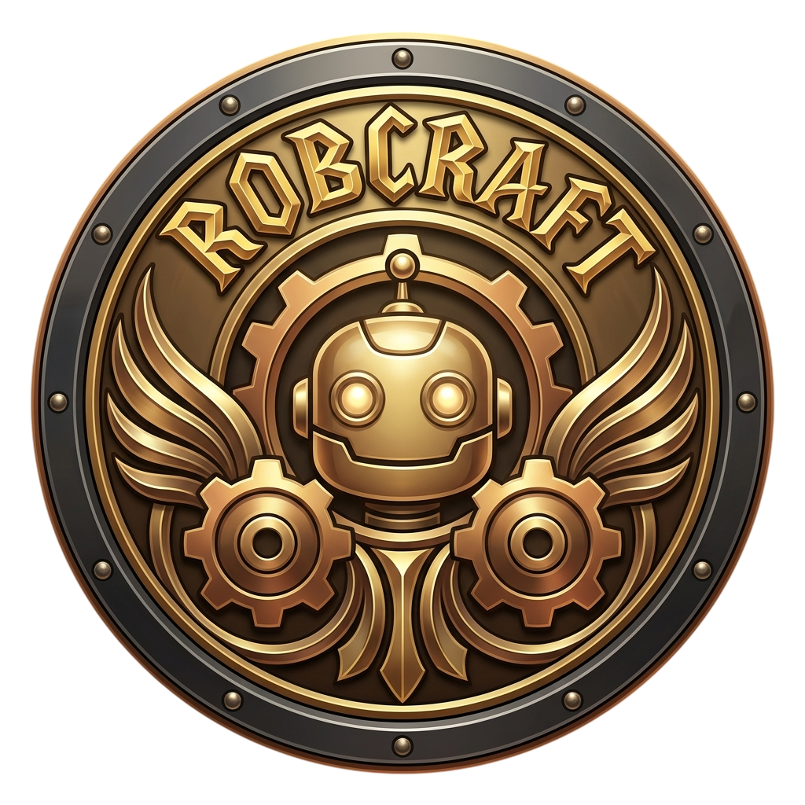

# RobCraft

---

<p align="center">
  
</p>

Lightweight robotics simulator inspired by the engineering philosophy of Warcraft III. Fast, deterministic, portable, and ROS 2 native. Designed to run on modest hardware.

---

<div align="center">

[](https://opensource.org/license/apache-2-0)
[](https://github.com/mgonzs13/robcraft/releases)
[](https://github.com/mgonzs13/robcraft?branch=main)
[](https://github.com/mgonzs13/robcraft/commits/main)

[](https://github.com/mgonzs13/robcraft/issues)
[](https://github.com/mgonzs13/robcraft/pulls)
[](https://github.com/mgonzs13/robcraft/graphs/contributors)

[](https://github.com/mgonzs13/robcraft/actions/workflows/python-formatter.yml?branch=main)
[](https://github.com/mgonzs13/robcraft/actions/workflows/cpp-formatter.yml?branch=main)

| ROS 2 Distro |                                                                                                      Build and Test                                                                                                      |
| :----------: | :----------------------------------------------------------------------------------------------------------------------------------------------------------------------------------------------------------------------: |
|   **Foxy**   |        [](https://github.com/mgonzs13/robcraft/actions/workflows/foxy-build-test.yml?branch=main)         |
| **Galactic** |  [](https://github.com/mgonzs13/robcraft/actions/workflows/galactic-build-test.yml?branch=main)   |
|  **Humble**  | [](https://github.com/mgonzs13/robcraft/actions/workflows/humble-build-test.yml?branch=main) |
|   **Iron**   |        [](https://github.com/mgonzs13/robcraft/actions/workflows/iron-build-test.yml?branch=main)         |
|  **Jazzy**   |       [](https://github.com/mgonzs13/robcraft/actions/workflows/jazzy-build-test.yml?branch=main)       |
|  **Kilted**  |     [](https://github.com/mgonzs13/robcraft/actions/workflows/kilted-build-test.yml?branch=main)      |
| **Lyrical**  |    [](https://github.com/mgonzs13/robcraft/actions/workflows/lyrical-build-test.yml?branch=main)    |

</div align="center">

## Installation

```bash
cd ~/ros2_ws/src
git clone https://github.com/mgonzs13/robcraft.git
rosdep install --from-paths src --ignore-src -r -y
cd ~/ros2_ws
colcon build
```

## Quick Start

```bash
# Run the simulator with the demo world
cd ~/ros2_ws
source install/setup.bash
ros2 robcraft run worlds/maze.world

# Open the world editor
ros2 robcraft edit

# Run tests
colcon test --packages-select robcraft robcraft_cli
colcon test-result --verbose
```

`ros2 robcraft run` starts the simulator empty when no world is given. Pass `--texture-size 256|512|1024` to change the texture resolution.

## Controls

| Key              | Action                        |
| ---------------- | ----------------------------- |
| I / K            | Move robot forward / backward |
| J / L            | Turn robot left / right       |
| TAB              | Switch controlled robot       |
| U                | Stop robot                    |
| WASD / QE        | Camera move                   |
| Right-click drag | Orbit camera                  |
| Scroll           | Zoom camera                   |
| Ctrl+O           | Open another world            |

## ROS 2 Topics

| Topic                             | Type                        |
| --------------------------------- | --------------------------- |
| `/clock`                          | `rosgraph_msgs/Clock`       |
| `/robot_N/cmd_vel`                | `geometry_msgs/Twist` (sub) |
| `/robot_N/odom`                   | `nav_msgs/Odometry`         |
| `/robot_N/scan`                   | `sensor_msgs/LaserScan`     |
| `/robot_N/imu`                    | `sensor_msgs/Imu`           |
| `/robot_N/gps`                    | `sensor_msgs/NavSatFix`     |
| `/robot_N/camera/image_raw`       | `sensor_msgs/Image`         |
| `/robot_N/camera/camera_info`     | `sensor_msgs/CameraInfo`    |
| `/robot_N/depth_camera/image_raw` | `sensor_msgs/Image`         |
| `/robot_N/lidar3d/points`         | `sensor_msgs/PointCloud2`   |
| `/tf`, `/tf_static`               | `tf2_msgs/TFMessage`        |

> Topics publish at their configured rates (camera 30 Hz, IMU 100 Hz, GPS 10 Hz, 2D lidar 15 Hz, 3D lidar 10 Hz, odometry 30 Hz) in both windowed and headless modes; rates are editable in the editor. Sensor data is generated at the 100 Hz sim tick rate.

Drive a robot (the demo world's robot is `robot_george_1`):

```bash
ros2 topic pub /robot_george_1/cmd_vel geometry_msgs/msg/Twist "{linear: {x: 1.0}, angular: {z: 0.5}}"
```

View the camera feed:

```bash
ros2 run rqt_image_view rqt_image_view /robot_george_1/camera/image_raw
```

## Maze Demo

### SLAM

```bash
ros2 launch robcraft_bringup sim.launch.py
```

```bash
ros2 launch robcraft_maze_demo nav2_bringup.launch.py slam:=True
```

### Navigation

```bash
ros2 launch robcraft_bringup sim.launch.py
```

```bash
ros2 launch robcraft_maze_demo nav2_bringup.launch.py
```

### EKF + VSLAM

```bash
ros2 launch robcraft_bringup sim.launch.py publish_odom_tf:=false
```

```bash
ros2 launch robcraft_maze_demo rtabmap_bringup.launch.py
```

### GPS + 3D Lidar

```bash
ros2 launch robcraft_bringup sim.launch.py publish_odom_tf:=false
```

```bash
ros2 launch robcraft_maze_demo gps_rtabmap_lidar3d_bringup.launch.py
```
